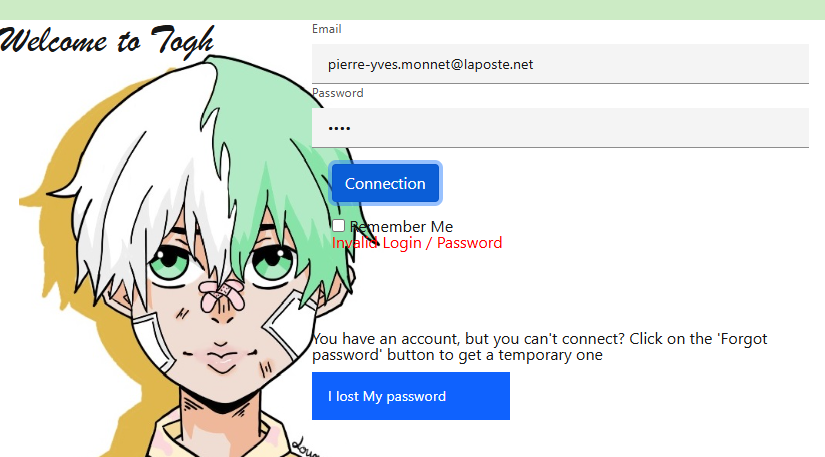
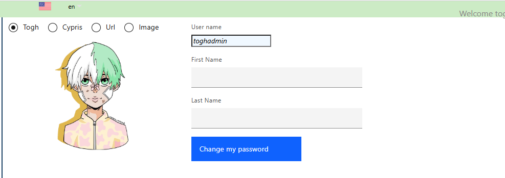
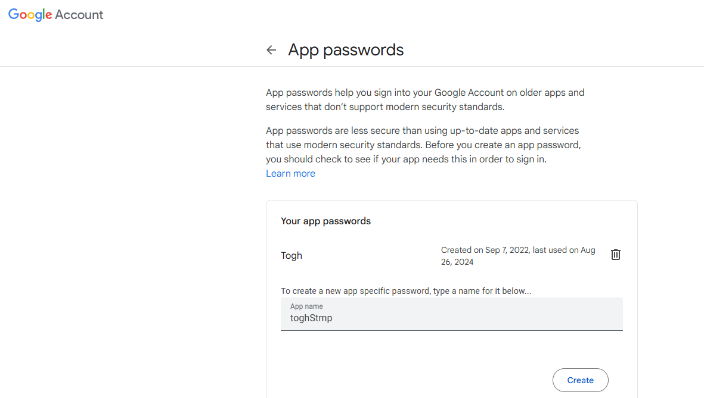

# Cloud GKE

See Docker documentation


# Google cloud

Create a google instance, ready to accept dockers images

https://cloud.google.com/community/tutorials/kotlin-springboot-compute-engine

# Publish the image on Google Repository

Github Action?

# Create the first docker compose

## First: postgres

The first docker creates the Postgres and the Togh pod

## Then Togh

# First access: change the password, add keys


First start ;
use toghadmin/togh to connect



Go to MyProfile



## Smtp

Create an application password
https://myaccount.google.com/apppasswords?pli=1&rapt=AEjHL4McBDQ0zWMWKf8san_RREmpP2Q-XzhZjDLU2dO_0gnT7XYxnqBqiZRqz-t23igUhcua_xdGEN8T5iPWRGp16otSAyjsE__9p1sAyRS-FtMHy042o2k


SMTP Server smtp.gmail.com
TLS 587
SSL 465

# Automatic backup


cd d:\atelier\cloud cloud_env.bat

## Google
  Create Google instance

> https://cloud.google.com/community/tutorials/cloud-run-local-dev-docker-compose

1. Create a Compute Engine instance, named toghinstance

2. Create a Service Account with the role "ContainerRegistry". Generate the KEY, get the JSON file and copy the file to
   the host

3. upload file from D:\dev\git\togh\GoogleCloud\intricate-gamma-325323-ContainerRegistry

docker login -u _json_key --password-stdin https://gcr.io  <intricate-gamma-325323-ContainerRegistry.json

export GCP_KEY_PATH=~/intricate-gamma-325323-ContainerRegistry.json

## Allow Docker to publish to gcr.io:

As a Windows administrator

```
> net localgroup docker-users rhaegal\pymonnet /add
> gcloud auth activate-service-account --key-file=D:\dev\git\togh\GoogleCloud\intricate-gamma-325323-0c23d50f1d04.json
> gcloud auth configure-docker
```

Create a firewall rule to allow my PC to access Postgres: 5432

docker run -it --rm --network="host" postgres psql -h 34.94.244.105 -U toghp

docker run -it --rm postgres psql -h toghpostgres -U toghpostgres

$ docker run --name some-postgres -e POSTGRES_PASSWORD=mysecretpassword -d postgres $ docker run -it --rm --network
some-network postgres psql -h some-postgres -U postgres

- SPRING_DATASOURCE_PASSWORD=root

gcloud config set project <<YOUR_PROJECT_NAME>>
gcloud config set compute/zone <<YOUR_SELECT_ZONE>>
docker logs <containerid>
sudo netstat -tulpn | grep LISTEN /* ******************************************************************************** */
/*                                                                                  */ /*
Docker                                                                            */
/*                                                                                  */
/*                                                                                  */
/*                                                                                  */
/* ******************************************************************************** */

# Docker Other commands

### docker image tomcat:

docker pull tomcat docker pull ubuntu docker run --name togh -h localhost -v d:/tmp/docker:/opt/togh -d -p 8080:8080
pierreyvesmonnet/togh:1.0.0

### main command

> image docker image ls docker image rm

> docker en execution docker ps -a docker stop <container id>
docker rm <container id>

Access the content of a container docker container ls -a
> > > without -a, there is nothing if the container does not run


docker export <containerId> > docimage.tar

docker logs 221

test backend:
http://localhost:7080/ping
test front end
http://localhost:3000

-------------------------------------- container vide Ajout des composants vi & postgres apt-get update apt-get install
vi

apt-get install postgresql postgresql-contrib

su - postgres pg_ctlcluster 11 main start

creation de la la base de donnée \conninfo psql CREATE DATABASE together;

## Arret de docker windows

wsl --shutdown

## domain:

www.1and1.com

## CI

https://tomgregory.com/building-a-spring-boot-application-in-jenkins/

# Administration

Go into an image docker run -it image_name sh docker run -it gcr.io/intricate-gamma-325323/togh:1.0.0 sh

/* ******************************************************************************** */
/*                                                                                  */ /*
Administration                                                                    */
/*                                                                                  */
/*                                                                                  */
/*                                                                                  */
/* ******************************************************************************** */

## Database

Dump:
``
pg_dump --blobs --create --encoding=UTF8 --host=34.125.198.71 --port=5432 --username=toghp --dbname=togh > d:\temp\togh.bak
``
password: ThisIsThog4Postgres

Import:
A/ Rename in d:\temp\togh.bak the database "togh" by the name togh_<date>
``
CREATE DATABASE togh_20211228 WITH TEMPLATE = template0 ENCODING = 'UTF8' LOCALE = 'en_US.utf8'; ALTER DATABASE togh_20211228 OWNER TO toghp; \connect togh_20211228
``

B/ Execute
``
psql --username=postgres < d:\temp\togh.bak
``
password: postgres Go to <Intellij>/src/main.ressource/application.properties and change the database
``
spring.datasource.url=jdbc:postgresql://localhost:5432/togh_20211228
``

## Hebergement

ovh

Pour l'hebergeur, j'étais chez O2switch. Ils sont français et tu as la main sur les registres DNS. Je les utilisais
juste pour ca et pour héberger des sous domaines en php. Ils sont aussi réactifs, j'étais tres satisfait.

https://github.com/chDame/fabulexie/blob/master/INSTALL.MD

# First start

# Documentation

## cloud

Deployer une image docker: 	
https://cloud.google.com/kubernetes-engine/docs/tutorials/hello-app

Deployer Postgres
https://cloud.google.com/solutions/deploying-highly-available-postgresql-with-gke
